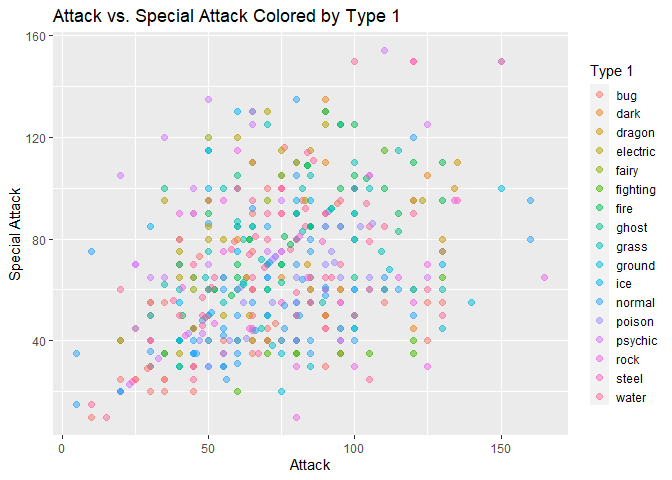
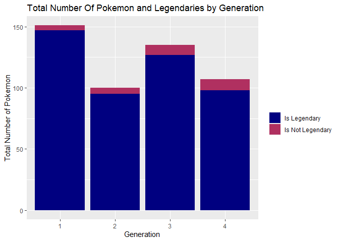
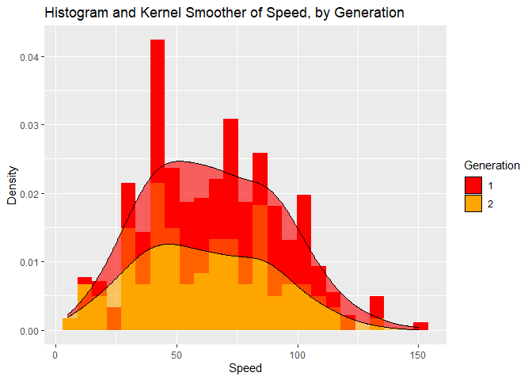
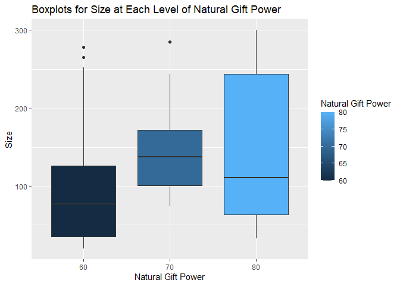
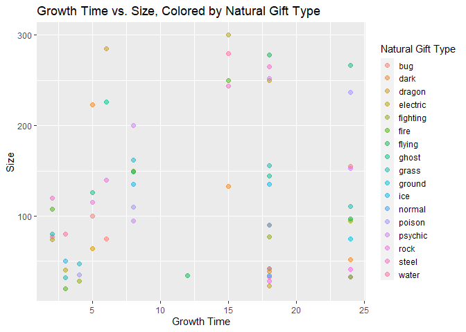

Pokemon API Vignette
================
Josh Baber
6/23/2022

## Setup

``` r
# render function, doesn't eval just here to copy/paste into console
rmarkdown::render('README.Rmd', 
                  output_format = "github_document",
                  output_options = list(
                    html_preview = FALSE
                    )
                  )
```

## Packages

``` r
# Packages
library(jsonlite)
library(tidyverse)
```

## Pokemon Query Functions

**Please Note That id must be a continuous range from 1 to a number!!**

``` r
# Define getPokemon function, can be done with vector of strings (names) or ID numbers,
# comes from pokemon endpoint
getPokemon <- function(pokemon = NULL, id = NULL){
  # If both pokemon and id arguments provided, throw this error
  if(!is.null(pokemon) & !is.null(id)){
    stop("Only can provide a vector of pokemon names or ids, not both")
  }
  # If a pokemon argument was provided
  if(!is.null(pokemon)){
    # Check if the pokemon argument is a character type
    if(!is.character(pokemon)){
      # If not a character type, show this error message
      stop("Pokemon name must be provided as a string/character vector")
    }
    # Part of URL that doesn't change
    baseURL <- "https://pokeapi.co/api/v2/pokemon/"
    # Part of URL that is based on argument
    name <- pokemon
    # Paste the two together into one string
    fullURL <- paste0(baseURL, name)
    # Read in the JSON file from the API with the full URL string
    pokeinfo <- fromJSON(fullURL)
  }
  # If an id argument was provided
  if(!is.null(id)){
    # Check if the id argument was numeric
    if(!is.numeric(id)){
      # If it wasn't numeric, show this error message
      stop("ID number must be a numeric value/vector")
    }
    # Part of URL that doesn't change
    baseURL <- "https://pokeapi.co/api/v2/pokemon/"
    # Part of URL that is based on argument
    pokedexnum <- id
    # Paste the two together into one string
    fullURL <- paste0(baseURL, pokedexnum)
    # Read in the JSON file from the API with the full URL string
    pokeinfo <- fromJSON(fullURL)
  }
  # Return the info on the pokemon
  return(pokeinfo)
}
```

``` r
# Define getPokeInfo function, can be done with strings (names) or id numbers,
# comes from pokemon-species endpoint
getPokeInfo <- function(pokemon = NULL, id = NULL){
  # Check if both pokemon and id arguments were passed, if so, throw this error message
  if(!is.null(pokemon) & !is.null(id)){
    stop("Only can provide a vector of pokemon names or ids, not both")
  }
  # If a pokemon argument was provided
  if(!is.null(pokemon)){
    # Check if the pokemon argument is a character type
    if(!is.character(pokemon)){
      # If not a character type, show this error message
      stop("Pokemon name must be provided as a string/character vector")
    }
    # Part of URL that doesn't change
    baseURL <- "https://pokeapi.co/api/v2/pokemon-species/"
    # Part of URL that is based on argument
    name <- pokemon
    # Paste the two together into one string
    fullURL <- paste0(baseURL, pokemon)
    # Read in the JSON file from the API with the full URL string
    pokemoninfo <- fromJSON(fullURL)
  }
  # If an id argument was provided
  if(!is.null(id)){
    # Check if the id argument was numeric
    if(!is.numeric(id)){
      # If it wasn't numeric, show this error message
      stop("ID number must be a numeric value/vector")
    }
    # Part of URL that doesn't change
    baseURL <- "https://pokeapi.co/api/v2/pokemon-species/"
    # Part of URL that is based on argument
    pokedexnum <- id
    # Paste the two together into one string
    fullURL <- paste0(baseURL, pokedexnum)
    # Read in the JSON file from the API with the full URL string
    pokemoninfo <- fromJSON(fullURL)
  }
  # Return the info on the pokemon
  return(pokemoninfo)
}
```

``` r
# Function that combines the data from the pokemon endpoint and the pokemon-species endpoint,
# can pass it a vector of strings (names) or id numbers and optional argument vars which
# will select only specified variables from each pokemon
fullPokeInfo <- function(pokemon = NULL, id = NULL, vars = all()){
  # Checks if both a pokemon and id argument were passed, throws this error if so
  if(!is.null(pokemon) & !is.null(id)){
    stop("Only can provide a vector of pokemon names or ids, not both")
  }
  # If a pokemon argument was provided
  if(!is.null(pokemon)){
    # Check if the pokemon argument is a character type
    if(!is.character(pokemon)){
      # If not a character type, show this error message
      stop("Pokemon name must be provided as a string/character vector")
    }
    # Initiate empty lists for some potential looping
    basepoke <- list()
    speciespoke <- list()
    fullpoke <- list()
    # If we received a vector of pokemon names, we can loop through them
    for(i in pokemon){
      # Grab the data from the pokemon endpoint
      basepoke[[i]] <- getPokemon(pokemon = i)
      # Grab the data from the pokemon-species endpoint
      speciespoke[[i]] <- getPokeInfo(pokemon = i)
      # Combine the two into one list
      fullpoke[[i]] <- c(basepoke[[i]], speciespoke[[i]])
    }
    # Subset the full list into just the variables specified with vars
    fullpoke2 <- lapply(fullpoke, function(x)x[vars])
    # Return the list with the combined data for each pokemon
    return(fullpoke2)
  }
  # If an id argument was provided
  if(!is.null(id)){
    # Check if the id argument was numeric
    if(!is.numeric(id)){
      # If it wasn't numeric, show this error message
      stop("ID number must be a numeric value or vector")
    }
    # Initialize empty lists for some potential looping
    idpokemon <- list()
    idspecies <- list()
    idfull <- list()
    # If multiple id numbers were given to id argument, we can loop through them
    # Pretty sure this is where the id variable gets weird.  Couldn't figure out
    # How to make it more flexible.
    for(i in id){
      # Grab the data from the pokemon endpoint
      idpokemon[[i]] <- getPokemon(id = i)
      # Grab the data from the pokemon-species endpoint
      idspecies[[i]] <- getPokeInfo(id = i)
      # Combine the two into one list
      idfull[[i]] <- c(idpokemon[[i]], idspecies[[i]])
    }
    # Subset the full list into just the variables specified with vars
    idfull2 <- lapply(idfull, function(x)x[vars])
    # Return the list with the combined data for each pokemon
    return(idfull2)
  }
}
```

## Berry Query Functions

**Please Note That id must be a continuous range from 1 to a number!!**

``` r
# Define getBerry function, can be done with a vector of strings (names) or id numbers
getBerry <- function(berry = NULL, id = NULL){
  # Check if both berry and id arguments passed, if so, need to throw this error message
  if(!is.null(berry) & !is.null(id)){
    stop("Only can provide a vector of berry names or ids, not both")
  }
  # If a berry argument was provided
  if(!is.null(berry)){
    # Check if the berry argument is a character type
    if(!is.character(berry)){
      # If not a character type, show this error message
      stop("Berry name must be provided as a string")
    }
    # Part of URL that doesn't change
    baseURL <- "https://pokeapi.co/api/v2/berry/"
    # Part of URL that is based on argument
    name <- berry
    # Paste the two together into one string
    fullURL <- paste0(baseURL, name)
    # Read in the JSON file from the API with the full URL string
    berryinfo <- fromJSON(fullURL)
  }
  # If an id argument was provided
  if(!is.null(id)){
    # Check if the id argument was numeric
    if(!is.numeric(id)){
      # If it wasn't numeric, show this error message
      stop("ID number must be a numeric value")
    }
    # Part of URL that doesn't change
    baseURL <- "https://pokeapi.co/api/v2/berry/"
    # Part of URL that is based on argument
    berrynum <- id
    # Paste the two together into one string
    fullURL <- paste0(baseURL, berrynum)
    # Read in the JSON file from the API with the full URL string
    berryinfo <- fromJSON(fullURL)
  }
  # Return the info on the pokemon
  return(berryinfo)
}
```

``` r
# Now we can customize a function that will allow us to get the info for a vector of berry names 
# or id numbers.  Also we have an optional vars argument to pass a vector of variable names to 
# keep, with all variables being the default
berryInfo <- function(berry = NULL, id = NULL, vars = all()){
  # Check if both berry and id arguments were passed, if so, need to throw this error message
  if(!is.null(berry) & !is.null(id)){
    stop("Only can provide a vector of berry names or ids, not both")
  }
  # If a berry argument was provided
  if(!is.null(berry)){
    # Check if the berry argument is a character type
    if(!is.character(berry)){
      # If not a character type, show this error message
      stop("Berry name must be provided as a string")
    }
    # Initialize an empty list
    berryinfo <- list()
    # Add the berry info for each requested berry to our berryinfo list
    for(i in berry){
      berryinfo[[i]] <- getBerry(berry = i)
    }
    # Subset each iteration of our berryinfo list to contain the vars specified
    berrylist <- lapply(berryinfo, function(x)x[vars])
    # Return the list
    return(berrylist)
  }
  # If an id argument was provided
  if(!is.null(id)){
    # Check if the id argument was numeric
    if(!is.numeric(id)){
      # If it wasn't numeric, show this error message
      stop("ID number must be a numeric value or vector")
    }
    # Initialize an empty list
    idberry <- list()
    # Add the berry info for each requested berry to our idberry list
    for(i in id){
      idberry[[i]] <- getBerry(id = i)
    }
    # Subset each iteration of our idberry list to contain the vars specified
    idlist <- lapply(idberry, function(x)x[vars])
    # Return the list
    return(idlist)
  }
}
```

## Helper Functions for Creating Tibbles from Queries

``` r
# Create a function that will convert one of our output lists to a tibble.  I can't put this
# In the functions above because some of the objects that are returned in the list won't fit into
# A data frame with other objects.  We return several data frames, values, vectors, list, etc. so
# we have to parse it all separately
convertToTibble <- function(list){
  # Create a data frame from a matrix created from a list
  df = as.data.frame(matrix(unlist(list), nrow = length(list), byrow = T))
  # Convert data frame to tibble so it will be compliant with tidyverse functions
  tibble = tibble(df)
  # Return the tibble
  return(tibble)
}
```

### Pokemon Helper Functions

``` r
# Abilities are stored in a data frame, so I need a function to help convert to a tibble
getAbilities <- function(list){
  # Subset to just the abilities for each pokemon in list
  abilities <- lapply(list, function(x)x["abilities"]$abilities)
  # Initialize empty vectors, some pokemon may have 3 possible abilities
  ability1 <- vector()
  ability2 <- vector()
  ability3 <- vector()
  # Loop through each pokemon's abilities list
  for(i in 1:length(abilities)){
    # If there is not a 1st ability say "none", else return ability name to ability1
    ability1[i] <- ifelse(is.na(abilities[[i]]$ability$name[1]), "none", abilities[[i]]$ability$name[1])
    # If there is not a 2nd ability say "none", else return ability name to ability2
    ability2[i] <- ifelse(is.na(abilities[[i]]$ability$name[2]), "none", abilities[[i]]$ability$name[2])
    # If there is not a 3rd ability say "none", else return ability name to ability3
    ability3[i] <- ifelse(is.na(abilities[[i]]$ability$name[3]), "none", abilities[[i]]$ability$name[3])
  }
  # Return a tibble of the three ability columns
  return(tibble(ability1, ability2, ability3))
}
```

``` r
# Since stats is also stored in a list, it will take some work to get out what I want
getStats <- function(list){
  # Subset to just the stats list for each pokemon in list
  stats <- lapply(list, function(x)x["stats"]$stats)
  # Every pokemon has six stats, initialize lists for them
  hp <- vector()
  attack <- vector()
  defense <- vector()
  special_attack <- vector()
  special_defense <- vector()
  speed <- vector()
  # Loop through each pokemon's stats list
  for(i in 1:length(stats)){
    # Append vectors with the corresponding stat from base_stat
    hp[i] <- stats[[i]]$base_stat[1]
    attack[i] <- stats[[i]]$base_stat[2]
    defense[i] <- stats[[i]]$base_stat[3]
    special_attack[i] <- stats[[i]]$base_stat[4]
    special_defense[i] <- stats[[i]]$base_stat[5]
    speed[i] <- stats[[i]]$base_stat[6]
  }
  # Return a tibble of stats for each pokemon
  return(tibble(hp, attack, defense, special_attack, special_defense, speed))
}
```

``` r
# Last but not least, we need types
getTypes <- function(list){
  # Subset to just the types list for each pokemon in list
  types <- lapply(list, function(x)x["types"]$types)
  # Every pokemon has one or two types, intialize empty lists
  type1 <- vector()
  type2 <- vector()
  # Loop through each pokemon's types list
  for(i in 1:length(types)){
    # If there is not a 1st type, return "none", otherwise return the type name
    type1[i] <- ifelse(is.na(types[[i]]$type$name[1]), "none", types[[i]]$type$name[1])
    # If there is not a 2nd type, return "none", otherwise return the type name
    type2[i] <- ifelse(is.na(types[[i]]$type$name[2]), "none", types[[i]]$type$name[2])
  }
  # Return tibble of types
  return(tibble(type1, type2))
}
```

### Berry Helper Functions

``` r
# Firmness is stored in a list, need a function to parse this data
getFirmness <- function(list){
  # Subset to just the firmness list for each berry in list
  firm <- lapply(list, function(x)x["firmness"]$firmness)
  # Initialize firmness vector
  firmness <- vector()
  # Loop through each berry's firmness list
  for(i in 1:length(firm)){
    # Append the "name" value of firmness onto the vector for each berry
    firmness[i] <- firm[[i]]$name
  }
  # Return tibble of types
  return(tibble(firmness))
}
```

<https://bulbapedia.bulbagarden.net/wiki/Natural_Gift_(move)>

``` r
# Natural Gift Type is stored in a list, need a function to parse this data
getNatGiftType <- function(list){
  # Subset to just the natural_gift_type list for each berry in list
  giftType <- lapply(list, function(x)x["natural_gift_type"]$natural_gift_type)
  # Initialize natural_gift_type vector
  natural_gift_type <- vector()
  # Loop through each berry's giftType list
  for(i in 1:length(giftType)){
    # Append the "name" value of giftType onto the vector for each berry
    natural_gift_type[i] <- giftType[[i]]$name
  }
  # Return tibble of types
  return(tibble(natural_gift_type))
}
```

``` r
# Since flavors is also stored in a list, it will take some work to get out what I want
getFlavors <- function(list){
  # Subset to just the flavors list for each berry in list
  flavors <- lapply(list, function(x)x["flavors"]$flavors)
  # Every berry has five flavors, initialize lists for them
  spicy <- vector()
  dry <- vector()
  sweet <- vector()
  bitter <- vector()
  sour <- vector()
  # Loop through each berry's flavors list
  for(i in 1:length(flavors)){
    # Append vectors with the corresponding stat from potency
    spicy[i] <- flavors[[i]]$potency[1]
    dry[i] <- flavors[[i]]$potency[2]
    sweet[i] <- flavors[[i]]$potency[3]
    bitter[i] <- flavors[[i]]$potency[4]
    sour[i] <- flavors[[i]]$potency[5]
  }
  # Return a tibble of flavor values for each berry
  return(tibble(spicy, dry, sweet, bitter, sour))
}
```

``` r
# item name is stored in a list, need a function to parse this data
getItem <- function(list){
  # Subset to just the item list for each berry in list
  items <- lapply(list, function(x)x["item"]$item)
  # Initialize item_name vector
  item_name <- vector()
  # Loop through each berry's items list
  for(i in 1:length(items)){
    # Append the "name" value of items onto the vector for each berry
    item_name[i] <- items[[i]]$name
  }
  # Return tibble of item names
  return(tibble(item_name))
}
```

## Create Pokemon Tibble

``` r
# Function that will parse a pokemon query into a tibble 
pokeTibble <- function(pokemon = NULL, id = NULL, vars){
  # Get a list from fullPokeInfo()
  pokelist <- fullPokeInfo(pokemon = pokemon, id = id, vars = vars)
  # These variables are data frames in the list, need to have use helper functions to get them usable
  dfs <- c("types", "abilities", "stats")
  # These variables are not data frames and can be easily put into a tibble
  nondfs <- c("name", "id", "height", "weight", "capture_rate", "base_experience", "base_happiness", "is_baby", "is_legendary", "is_mythical", "is_default", "order", "hatch_counter")
  # These variables are either pretty useless, too large, contain urls, or are hard to work with and give me errors
  badvars <- c("forms", "game_indices", "held_items", "location_area_encounters", "moves", "past_types", "species", "sprites", "color", "egg_groups", "evolution_chain", "flavor_text_entries", "form_descriptions", "has_gender_differences", "gender_rate", "evolves_from_species", "forms_switchable", "genera", "generation", "growth_rate", "habitat", "names", "pal_park_encounters", "pokedex_numbers", "shape", "varities")
  # These variables are numeric, need to be explicitly coerced into numeric variables later
  numericvars <- c("height", "weight", "capture_rate", "base_experience", "base_happiness", "order", "hatch_counter")
  # These variables are logical, need to be explicitly coerced into logical variables later
  logicalvars <- c("is_baby", "is_legendary", "is_mythical", "is_default")
  # First I want to throw an error if a "badvar" was passed in the vars argument, since they can't go
  # in a tibble
  for(i in badvars){
    if(i %in% vars){
      stop(paste0(i, " is not a valid variable, please remove.  Valid variables include name, id, height, weight, capture_rate, base_experience, base_happiness, is_baby, is_legendary, is_mythical, is_default, order, evolves_from_species, forms_switchable, gender_rate, has_gender_differences, hatch_counter, types, abilities, and stats"))
    }
  }
  # Next, initialize an empty vector for variables
  nondfvars = c()
  # For every nondf variable
  for(i in nondfs){
    # Check if it was passed in the vars argument
    if(i %in% vars){
      # If so, append it to the nondfvars vector
      nondfvars[i] <- i
    }
  }
  # Now that we have a vector nondf vars that were passed, we can subset each pokemon's list and call it values
  values <- lapply(pokelist, function(x)x[nondfvars])
  # Convert to a tibble
  valuestibble <- convertToTibble(values)
  # Rename the columns
  colnames(valuestibble) <- nondfvars
  # Next we need to consider our variables that are stuck in data frames, initialize an empty vector named dfvars
  dfvars = c()
  # For every df variable
  for(i in dfs){
    # Check if it was passed in the vars argument
    if(i %in% vars){
      # If so, append it to the dfvars vector
      dfvars[i] <- i
    }
  }
  # Check if "types" was a variable passed, if so, create a types tibble using getTypes() and append it to the valuestibble
  if("types" %in% dfvars){
    types <- getTypes(pokelist)
    valuestibble <- tibble(valuestibble, types)
  }
  # Check if "abilities" was a variable passed, if so, create an abilities tibble using getAbilities() and append it to the valuestibble
  if("abilities" %in% dfvars){
    abilities <- getAbilities(pokelist)
    valuestibble <- tibble(valuestibble, abilities)
  }
  # Check if "stats" was a variable passed, if so, create a stats tibble using getStats() and append it to the valuestibble
  if("stats" %in% dfvars){
    stats <- getStats(pokelist)
    valuestibble <- tibble(valuestibble, stats)
  }
  # Now we need to convert numeric variables into integer values if possible
  for(i in colnames(valuestibble)){
    # If a column name is in our numericvars vector
    if(i %in% numericvars){
      # Replace the values in that column with the integer value of it
      valuestibble[[i]] <- as.integer(valuestibble[[i]])
    }
    # If a column name is in our logicalvars vector
    if(i %in% logicalvars){
      # Replace the values in that column with the logical value of it
      valuestibble[[i]] <- as.logical(valuestibble[[i]])
    }
  }
  # Return our tibble
  return(valuestibble)
}
```

## Create Berry Tibble

``` r
# Similar function but for berries, can take in berry or id and a vector of variables
berryTibble <- function(berry = NULL, id = NULL, vars){
  # Get a list of berry info from the berryInfo() function
  berrylist <- berryInfo(berry = berry, id = id, vars = vars)
  # These are the variables that require extra parsing because they are in list/data frames
  dfs <- c("flavors", "natural_gift_type", "firmness", "item")
  # These variables do no require extra parsing
  nondfs <- c("name", "id", "growth_time", "max_harvest", "natural_gift_power", "size", "smoothness", "soil_dryness")
  # These variables are supposed to be numeric, will have to convert them to numeric later
  numericvars <- c("growth_time", "max_harvest", "natural_gift_power", "size", "smoothness", "soil_dryness")
  # Initialize an empty vector to hold nondf variables that were passed through vars argument
  nondfvars = c()
  # For every variable in nondfs
  for(i in nondfs){
    # Check if it was passed through vars argument
    if(i %in% vars){
      # If so, append that variable to the nondfvars vector
      nondfvars[i] <- i
    }
  }
  # Subset each berry list to contain the nondf vars variables
  values <- lapply(berrylist, function(x)x[nondfvars])
  # Convert to a tibble
  valuestibble <- convertToTibble(values)
  # Rename the columns
  colnames(valuestibble) <- nondfvars
  # Initialize an empty bector to hold df variables that were passed through vars argument
  dfvars = c()
  # For every variable in dfs
  for(i in dfs){
    # Check if it was passed through vars argument
    if(i %in% vars){
      # If so, append that variable to the dfvars vector
      dfvars[i] <- i
    }
  }
  # If "flavors" was in the vars argument, get the flavors tibble using getFlavors, 
  # then combine that tibble with the valuestibble
  if("flavors" %in% dfvars){
    flavors <- getFlavors(berrylist)
    valuestibble <- tibble(valuestibble, flavors)
  }
  # If "natural_gift_type" was in the vars argument, get the tibble using getNatGiftType, 
  # then combine that tibble with the valuestibble
  if("natural_gift_type" %in% dfvars){
    natural_gift_type <- getNatGiftType(berrylist)
    valuestibble <- tibble(valuestibble, natural_gift_type)
  }
  # If "firmness" was in the vars argument, get the flavors tibble using getFirmness, 
  # then combine that tibble with the valuestibble
  if("firmness" %in% dfvars){
    firmness <- getFirmness(berrylist)
    valuestibble <- tibble(valuestibble, firmness)
  }
  # If "item" was in the vars argument, get the item tibble using getItem, 
  # then combine that tibble with the valuestibble
  if("item" %in% dfvars){
    item <- getItem(berrylist)
    valuestibble <- tibble(valuestibble, item)
  }
  # Convert the numeric variables to numeric, check each column name in the tibble
  for(i in colnames(valuestibble)){
    # If the column name is in numericvars
    if(i %in% numericvars){
      # Convert that column to integer values
      valuestibble[[i]] <- as.integer(valuestibble[[i]])
    }
  }
  # Return the tibble
  return(valuestibble)
}
```

<https://bulbapedia.bulbagarden.net/wiki/Berry>

## Combine Tibble Functions Into One-Size-Fits-All Query Function

``` r
# Lastly, we can wrap everything together to produce nice tibbles for either pokemon or berry queries
queryAPI <- function(pokemon = NULL, pokeid = NULL, pokevars = NULL, berry = NULL, berryid = NULL, berryvars = NULL){
  # If only pokemon and pokevars arguments were passed
  if(!is.null(pokemon) & !is.null(pokevars) & is.null(c(pokeid, berry, berryid, berryvars))){
    # Create a pokeTibble from the pokemon and pokevars arguments and return it
    poketibble <- pokeTibble(pokemon = pokemon, vars = pokevars)
    return(poketibble)
  }
  # Else if only pokeid and pokevars arguments were passed
  else if(!is.null(pokeid) & !is.null(pokevars) & is.null(c(pokemon, berry, berryid, berryvars))){
    # Create a pokeTibble from the pokeid and pokevars arguments and return it
    poketibble <- pokeTibble(id = pokeid, vars = pokevars)
    return(poketibble)
  }
  # Else if only berry and berryvars arguments were passed
  else if(!is.null(berry) & !is.null(berryvars) & is.null(c(pokemon, pokeid, pokevars, berryid))){
    # Create a berryTibble from the berry and berryvars arguments and return it
    berrytibble <- berryTibble(berry = berry, vars = berryvars)
    return(berrytibble)
  }
  # Else if only berryid and berryvars arguments were passed
  else if(!is.null(berryid) & !is.null(berryvars) & is.null(c(pokemon, pokeid, pokevars, berry))){
    # Create a berryTibble the berryid and berryvars arguments and return it
    berrytibble <- berryTibble(id = berryid, vars = berryvars)
    return(berrytibble)
  }
  # If some other combination of arguments was passed, it is invalid, return this error message
  else{
    stop("Must provided either names and variables or ids and variables for pokemon or for berries, not both!")
  }
}
```

## Demonstrate `queryAPI()`

``` r
# These are the variables I am going to be working with in my EDA for pokemon and berries
myPokeVars <- c("name", "id", "types", "abilities", "height", "weight", "is_baby", "is_legendary", "is_mythical", "capture_rate", "stats")
myBerryVars <- c("name", "id", "growth_time", "max_harvest", "natural_gift_power", "size", "smoothness", "soil_dryness", "flavors", "natural_gift_type", "firmness", "item")
```

``` r
# Test that it works for pokemon and pokevars combination
queryAPI(pokemon = c("pikachu", "mewtwo", "greninja", "igglybuff", "rayquaza"), pokevars = myPokeVars)
```

    ## # A tibble: 5 × 19
    ##   name     id    height weight capture_rate is_baby is_legendary
    ##   <chr>    <chr>  <int>  <int>        <int> <lgl>   <lgl>       
    ## 1 pikachu  25         4     60          190 FALSE   FALSE       
    ## 2 mewtwo   150       20   1220            3 FALSE   TRUE        
    ## 3 greninja 658       15    400           45 FALSE   FALSE       
    ## 4 igglybu… 174        3     10          170 TRUE    FALSE       
    ## 5 rayquaza 384       70   2065           45 FALSE   TRUE        
    ## # … with 12 more variables: is_mythical <lgl>, type1 <chr>,
    ## #   type2 <chr>, ability1 <chr>, ability2 <chr>,
    ## #   ability3 <chr>, hp <int>, attack <int>, defense <int>,
    ## #   special_attack <int>, special_defense <int>, speed <int>

``` r
# Test that it works for pokeid and pokevars combination
queryAPI(pokeid = c(1:10), pokevars = myPokeVars)
```

    ## # A tibble: 10 × 19
    ##    name    id    height weight capture_rate is_baby is_legendary
    ##    <chr>   <chr>  <int>  <int>        <int> <lgl>   <lgl>       
    ##  1 bulbas… 1          7     69           45 FALSE   FALSE       
    ##  2 ivysaur 2         10    130           45 FALSE   FALSE       
    ##  3 venusa… 3         20   1000           45 FALSE   FALSE       
    ##  4 charma… 4          6     85           45 FALSE   FALSE       
    ##  5 charme… 5         11    190           45 FALSE   FALSE       
    ##  6 chariz… 6         17    905           45 FALSE   FALSE       
    ##  7 squirt… 7          5     90           45 FALSE   FALSE       
    ##  8 wartor… 8         10    225           45 FALSE   FALSE       
    ##  9 blasto… 9         16    855           45 FALSE   FALSE       
    ## 10 caterp… 10         3     29          255 FALSE   FALSE       
    ## # … with 12 more variables: is_mythical <lgl>, type1 <chr>,
    ## #   type2 <chr>, ability1 <chr>, ability2 <chr>,
    ## #   ability3 <chr>, hp <int>, attack <int>, defense <int>,
    ## #   special_attack <int>, special_defense <int>, speed <int>

``` r
# Test that it works for berry and berryvars combination
queryAPI(berry = c("cheri", "rawst", "chesto"), berryvars = myBerryVars)
```

    ## # A tibble: 3 × 16
    ##   name   id    growth_time max_harvest natural_gift_power  size
    ##   <chr>  <chr>       <int>       <int>              <int> <int>
    ## 1 cheri  1               3           5                 60    20
    ## 2 rawst  4               3           5                 60    32
    ## 3 chesto 2               3           5                 60    80
    ## # … with 10 more variables: smoothness <int>,
    ## #   soil_dryness <int>, spicy <int>, dry <int>, sweet <int>,
    ## #   bitter <int>, sour <int>, natural_gift_type <chr>,
    ## #   firmness <chr>, item_name <chr>

``` r
# Test that it works for berryid and berryvars combination
queryAPI(berryid = 1:64, berryvars = myBerryVars)
```

    ## # A tibble: 64 × 16
    ##    name   id    growth_time max_harvest natural_gift_power  size
    ##    <chr>  <chr>       <int>       <int>              <int> <int>
    ##  1 cheri  1               3           5                 60    20
    ##  2 chesto 2               3           5                 60    80
    ##  3 pecha  3               3           5                 60    40
    ##  4 rawst  4               3           5                 60    32
    ##  5 aspear 5               3           5                 60    50
    ##  6 leppa  6               4           5                 60    28
    ##  7 oran   7               4           5                 60    35
    ##  8 persim 8               4           5                 60    47
    ##  9 lum    9              12           5                 60    34
    ## 10 sitrus 10              8           5                 60    95
    ## # … with 54 more rows, and 10 more variables: smoothness <int>,
    ## #   soil_dryness <int>, spicy <int>, dry <int>, sweet <int>,
    ## #   bitter <int>, sour <int>, natural_gift_type <chr>,
    ## #   firmness <chr>, item_name <chr>

## Exploratory Data Analysis (EDA)

### Create My Data Sets

``` r
# These are the variables I am going to be working with in my EDA for pokemon and berries
myPokeVars <- c("name", "id", "types", "abilities", "height", "weight", "is_baby", "is_legendary", "is_mythical", "capture_rate", "stats")
myBerryVars <- c("name", "id", "growth_time", "max_harvest", "natural_gift_power", "size", "smoothness", "soil_dryness", "flavors", "natural_gift_type", "firmness", "item")
```

``` r
# Generate data set for first four generations of pokemon (My childhood)
myPokeData <- queryAPI(pokeid = 1:493, pokevars = myPokeVars)
```

``` r
# Generate data set for all berries (there are 64 total)
myBerryData <- queryAPI(berryid = 1:64, berryvars = myBerryVars)
```

### Create generation Variable

<https://bulbapedia.bulbagarden.net/wiki/Generation>

``` r
# Convert id to numeric just for the purpose of subsetting
idnums <- as.integer(myPokeData$id)
# Bin based on the id variables using ifelse() and save as a vector named generation.  These values came from bulbapedia.
generation <- ifelse(idnums <= 151, "1",
                       ifelse(idnums > 151 & idnums <= 251 , "2",
                                ifelse(idnums > 251 & idnums <= 386, "3",
                                         ifelse(idnums > 386 & idnums <= 493, "4",
                                                  ifelse(idnums > 493 & idnums <= 649, "5",
                                                           ifelse(idnums > 649 & idnums <= 721, "6",
                                                                    ifelse(idnums > 721 & idnums <= 809, "7",
                                                                             ifelse(idnums > 809 & idnums <= 905, "8", "None"))))))))
# Append the generation vector onto the myPokeData tibble
myPokeData <- myPokeData %>% mutate(generation = generation)
# Print the first few observations with just three columns to check
head(myPokeData) %>% select(name, id, generation)
```

    ## # A tibble: 6 × 3
    ##   name       id    generation
    ##   <chr>      <chr> <chr>     
    ## 1 bulbasaur  1     1         
    ## 2 ivysaur    2     1         
    ## 3 venusaur   3     1         
    ## 4 charmander 4     1         
    ## 5 charmeleon 5     1         
    ## 6 charizard  6     1

``` r
# Print the last few observations with just three columns to check
tail(myPokeData) %>% select(name, id, generation)
```

    ## # A tibble: 6 × 3
    ##   name         id    generation
    ##   <chr>        <chr> <chr>     
    ## 1 cresselia    488   4         
    ## 2 phione       489   4         
    ## 3 manaphy      490   4         
    ## 4 darkrai      491   4         
    ## 5 shaymin-land 492   4         
    ## 6 arceus       493   4

### Create Some Contingency Tables

``` r
# Counts of legendaries and non-legendaries
table(myPokeData$is_legendary)
```

    ## 
    ## FALSE  TRUE 
    ##   467    26

``` r
# Counts of type 1s
table(myPokeData$type1)
```

    ## 
    ##      bug     dark   dragon electric    fairy fighting     fire 
    ##       42       12       13       26        8       15       31 
    ##    ghost    grass   ground      ice   normal   poison  psychic 
    ##       14       46       21       15       72       24       30 
    ##     rock    steel    water 
    ##       27       14       83

``` r
# Counts of type 2s
table(myPokeData$type2)
```

    ## 
    ##      bug     dark   dragon electric    fairy fighting     fire 
    ##        3       11        6        2       12       10        2 
    ##   flying    ghost    grass   ground      ice     none   poison 
    ##       64        4        9       26        7      258       26 
    ##  psychic     rock    steel    water 
    ##       23       10       11        9

``` r
# Counts of type 1s and type 2s
table(myPokeData$type1, myPokeData$type2)
```

    ##           
    ##            bug dark dragon electric fairy fighting fire flying
    ##   bug        0    0      0        0     0        1    0     12
    ##   dark       0    0      0        0     0        0    2      2
    ##   dragon     0    0      0        0     0        0    0      4
    ##   electric   0    0      0        0     0        0    0      1
    ##   fairy      0    0      0        0     0        0    0      2
    ##   fighting   0    0      0        0     0        0    0      0
    ##   fire       0    0      0        0     0        4    0      3
    ##   ghost      0    1      1        0     0        0    0      2
    ##   grass      0    3      0        0     0        1    0      4
    ##   ground     0    0      2        0     0        0    0      2
    ##   ice        0    0      0        0     0        0    0      2
    ##   normal     0    0      0        0     4        0    0     17
    ##   poison     1    3      0        0     0        2    0      3
    ##   psychic    0    0      0        0     5        1    0      3
    ##   rock       2    1      0        0     0        0    0      1
    ##   steel      0    0      1        0     1        0    0      1
    ##   water      0    3      2        2     2        1    0      5
    ##           
    ##            ghost grass ground ice none poison psychic rock
    ##   bug          1     3      1   0   12      8       0    1
    ##   dark         1     0      0   2    5      0       0    0
    ##   dragon       0     0      3   0    4      0       2    0
    ##   electric     1     0      0   0   21      0       0    0
    ##   fairy        0     0      0   0    6      0       0    0
    ##   fighting     0     0      0   0   12      0       2    0
    ##   fire         0     0      2   0   20      0       0    1
    ##   ghost        0     0      0   0    7      3       0    0
    ##   grass        0     0      1   2   21     12       2    0
    ##   ground       0     0      0   0   12      0       2    3
    ##   ice          1     0      3   0    4      0       2    0
    ##   normal       0     0      0   0   49      0       1    0
    ##   poison       0     0      2   0   13      0       0    0
    ##   psychic      0     1      0   0   20      0       0    0
    ##   rock         0     2      6   0    6      0       2    0
    ##   steel        0     0      1   0    1      0       6    3
    ##   water        0     3      7   3   45      3       4    2
    ##           
    ##            steel water
    ##   bug          2     1
    ##   dark         0     0
    ##   dragon       0     0
    ##   electric     3     0
    ##   fairy        0     0
    ##   fighting     1     0
    ##   fire         1     0
    ##   ghost        0     0
    ##   grass        0     0
    ##   ground       0     0
    ##   ice          0     3
    ##   normal       0     1
    ##   poison       0     0
    ##   psychic      0     0
    ##   rock         3     4
    ##   steel        0     0
    ##   water        1     0

``` r
# Graph of Fire type 1s against generations
table(myPokeData$type1 == "fire", myPokeData$generation)
```

    ##        
    ##           1   2   3   4
    ##   FALSE 139  92 129 102
    ##   TRUE   12   8   6   5

``` r
# Graph of Fire type 2s against generations
table(myPokeData$type2 == "fire", myPokeData$generation)
```

    ##        
    ##           1   2   3   4
    ##   FALSE 151  98 135 107
    ##   TRUE    0   2   0   0

``` r
# One-way Contingency Table of Natural Gift Types
table(myBerryData$natural_gift_type)
```

    ## 
    ##      bug     dark   dragon electric fighting     fire   flying 
    ##        4        4        4        4        4        4        4 
    ##    ghost    grass   ground      ice   normal   poison  psychic 
    ##        4        4        4        4        1        4        4 
    ##     rock    steel    water 
    ##        4        3        4

``` r
# One-way contingency table of Natural Gift Power
table(myBerryData$natural_gift_power)
```

    ## 
    ## 60 70 80 
    ## 33 16 15

``` r
# Two-way contingency table of natural gift power and firmness
table(myBerryData$natural_gift_power, myBerryData$firmness)
```

    ##     
    ##      hard soft super-hard very-hard very-soft
    ##   60    6    9          8         5         5
    ##   70    6    5          2         2         1
    ##   80    3    4          2         4         2

### Numerical Summaries Across Different Categories

``` r
# Five number summary of hp across all four generations
summary(myPokeData$hp)
```

    ##    Min. 1st Qu.  Median    Mean 3rd Qu.    Max. 
    ##    1.00   50.00   65.00   67.91   80.00  255.00

``` r
# Get numerical summaries for capture rates of pokemon across each generation
myPokeData %>% 
  group_by(generation) %>% 
  summarize(mean = mean(capture_rate), sd = sd(capture_rate), min = min(capture_rate), max = max(capture_rate))
```

    ## # A tibble: 4 × 5
    ##   generation  mean    sd   min   max
    ##   <chr>      <dbl> <dbl> <int> <int>
    ## 1 1          106.   77.1     3   255
    ## 2 2           91.9  71.7     3   255
    ## 3 3          113.   83.8     3   255
    ## 4 4           78.9  69.5     3   255

``` r
# Get numerical summaries for capture rates of pokemon based on whether or not they are legendary
myPokeData %>%
  group_by(is_legendary) %>%
  summarize(mean = mean(capture_rate), sd = sd(capture_rate), min = min(capture_rate), max = max(capture_rate))
```

    ## # A tibble: 2 × 5
    ##   is_legendary   mean    sd   min   max
    ##   <lgl>         <dbl> <dbl> <int> <int>
    ## 1 FALSE        105.   76.0      3   255
    ## 2 TRUE           4.62  8.24     3    45

``` r
# Get numerical summaries for attack stat of pokemon based on whether or not they are a baby pokemon
myPokeData %>%
  group_by(is_baby) %>%
  summarize(mean = mean(attack), sd = sd(attack), min = min(attack), max = max(attack))
```

    ## # A tibble: 2 × 5
    ##   is_baby  mean    sd   min   max
    ##   <lgl>   <dbl> <dbl> <int> <int>
    ## 1 FALSE    74.9  28.6     5   165
    ## 2 TRUE     39.2  24.1     5    85

``` r
myBerryData %>%
  group_by(natural_gift_power) %>%
  summarize(mean = mean(growth_time), sd = sd(growth_time), min = min(growth_time), max = max(growth_time))
```

    ## # A tibble: 3 × 5
    ##   natural_gift_power  mean    sd   min   max
    ##                <int> <dbl> <dbl> <int> <int>
    ## 1                 60 11.5   6.99     2    18
    ## 2                 70  6.88  3.98     2    15
    ## 3                 80 22.2   3.73    15    24

``` r
myBerryData %>%
  group_by(firmness) %>%
  summarize(mean = mean(size), sd = sd(size), min = min(size), max = max(size))
```

    ## # A tibble: 5 × 5
    ##   firmness    mean    sd   min   max
    ##   <chr>      <dbl> <dbl> <int> <int>
    ## 1 hard        119.  59.9    32   280
    ## 2 soft        120.  82.1    20   252
    ## 3 super-hard  120.  97.6    34   285
    ## 4 very-hard   122.  76.3    28   278
    ## 5 very-soft   124. 118.     28   300

### Plots

``` r
# Scatterplot of Special Attack vs. Attack, colored by Type 1.  I gave custom labels and title.  Also change the opacity and size of the point and the size of the legend.
ggplot(myPokeData, aes(x = attack, y = special_attack, color = type1)) + geom_point(alpha = 0.5, size = 2) +
  theme(legend.key.size = unit(0.5, "cm")) + labs(x = "Attack", y = "Special Attack", title = "Attack vs. Special Attack Colored by Type 1") +
  scale_color_discrete("Type 1")
```

<!-- -->

``` r
# I needed to call in this fct_rev function to put the legendary pokemon on top, since they were on the bottom at first and I didn't like that.
library(forcats)
# Create a bar plot of total pokemon counts by generation.  Also filled bars based on whether or not pokemon were legendary.  This allows us to see the total amount of legendary pokemon as well.  Added custom labels, title, legend, and colors with labs() and scale_fill_manual()
ggplot(myPokeData, aes(x = generation)) + geom_bar(aes(fill = forcats::fct_rev(as.factor(is_legendary)))) + 
  labs(x = "Generation", y = "Total Number of Pokemon", title = "Total Number Of Pokemon and Legendaries by Generation") +
  scale_fill_manual(breaks = c(FALSE, TRUE), values = c("navy", "maroon"), name = " ", labels = c("Is Legendary", "Is Not Legendary"))
```

<!-- -->

``` r
# Subset the data into just gens 1 and 2
gens1and2 <- myPokeData %>% filter(generation < 3)
#  Create two histograms, one for each generation, with 25 bins for the speed stat.  Overlay a Density plot on each of them.  Customize labels, title, legend, and colors.
ggplot(gens1and2, aes(x = speed)) + geom_histogram(bins = 25, aes(y = ..density.., fill = generation)) +
  geom_density(aes(fill = generation), alpha = 0.6, position = "stack") + 
  labs(x = "Speed", y = "Density", title = "Histogram and Kernel Smoother of Speed, by Generation") +
  scale_fill_manual(name = "Generation", breaks = c("1", "2"), values = c("red", "orange"))
```

<!-- -->

``` r
# Create a boxplot for size for each value of natural gift power, since it's technically continuous, the colors will be a gradient.
# Made custom legend, labels, and title.
ggplot(myBerryData, aes(x = as.factor(as.character(natural_gift_power)), y = size, fill = natural_gift_power)) + geom_boxplot() +
  labs(x = "Natural Gift Power", y = "Size", title = "Boxplots for Size at Each Level of Natural Gift Power") +
  scale_fill_continuous(name = "Natural Gift Power")
```

<!-- -->

``` r
# Created a scatterplot of growth time vs. size, colored by natural gift type. Customized labels and title to make it look nice, also changed the size of legends and points, as well as opacity of points.
ggplot(myBerryData, aes(x = growth_time, y = size, color = natural_gift_type)) + geom_point(alpha = 0.5, size = 2) +
  theme(legend.key.size = unit(0.5, "cm")) + labs(x = "Growth Time", y = "Size", title = "Growth Time vs. Size, Colored by Natural Gift Type") +
  scale_color_discrete("Natural Gift Type")
```

<!-- -->
